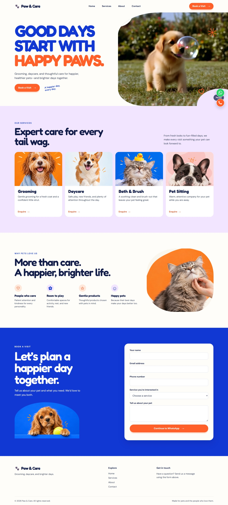
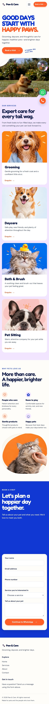

# Paw & Care 🐾

A playful, responsive landing page for a fictional pet grooming and daycare studio. Paw & Care introduces its services, shows its personality through pet photography and a hero video, and makes it easy for visitors to enquire through WhatsApp.

## Live Website

🔗 **[Visit Paw & Care]((https://vercel.com/shwetaleena-kundu/paw-and-care)**

## Preview

### Desktop landing page


### Mobile landing page



## Features

- Responsive single-page layout for desktop, tablet, and mobile
- Mobile navigation with accessible open and close controls
- Hero video with a play/pause button
- Four pet care services: Grooming, Daycare, Bath & Brush, and Pet Sitting
- Smooth navigation between page sections
- Enquiry form with HTML validation
- Form details prepared as a WhatsApp message
- Floating WhatsApp and call buttons
- Keyboard focus styles and reduced-motion support

## Tech Stack

**HTML5 · CSS3 · JavaScript**

The layout uses CSS Grid and Flexbox. The site does not require a framework or build step.

## How the Contact Form Works

After completing the form, the visitor is taken to WhatsApp with their enquiry already written. They must press **Send** in WhatsApp to deliver it. The floating call button opens the phone dialer on supported devices.

## Run Locally

1. Download or clone this repository.
2. Open the project folder in VS Code.
3. Open `index.html` with Live Server, or open it directly in a browser.

## Project Structure

```text
Paw-and-care/
├── assets/
│   ├── images/
│   └── videos/
│       └── hero.mp4
├── css/
│   ├── style.css
│   └── responsive.css
├── js/
│   └── script.js
├── screenshots/
│   ├── landing-page.jpeg
│   ├── landing-page-mobile.jpeg
│   ├── services.jpeg
│   └── contact-form.jpeg
├── index.html
└── README.md
```

## About This Project

Built for **Task 2: Responsive Business Landing Page** of the Week 1 web development assessment. The goal was to create a clear business landing page with a navigation bar, hero, services, contact form, and a layout that remains usable on smaller screens.

---

Designed and developed by **Shwetaleena Kundu**.
